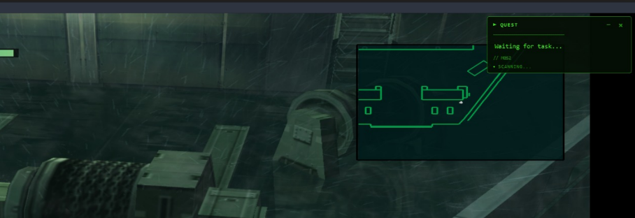
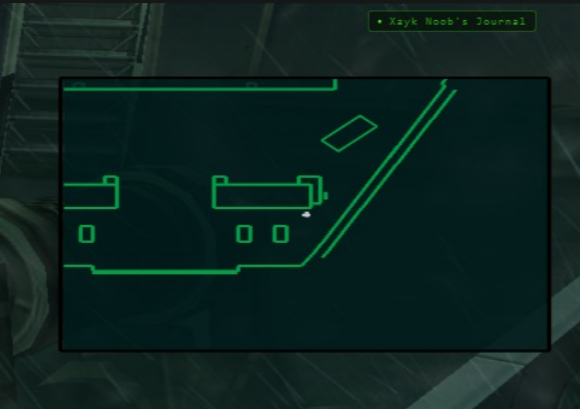

<p align="center">
  
  
  
</p>

# Xayk Noob's Journal

An overlay assistant for retro games that uses Gemini Vision to analyze your screen and provide guidance from walkthroughs.

> **Note:** This project is in beta. Some features are still being developed.

---

## Preview

<p align="center">
  
  <br>
  <em>Overlay expanded</em>
</p>

<p align="center">
  
  <br>
  <em>Overlay minimized</em>
</p>

---

## How to Use

### Requirements

| Requirement | Description |
|-------------|-------------|
| Python 3.10+ | [Download here](https://www.python.org/downloads/) |
| Gemini API Key | Free at [Google AI Studio](https://aistudio.google.com/app/apikey) |

### Installation (Windows)

1. Clone or download this repository

2. Double-click `install.bat` and wait for completion

3. Open the `.env` file and add your API key:
   ```
   GEMINI_API_KEY=your_api_key_here
   ```

4. Double-click `run.bat` to start

### Manual Installation

```bash
git clone https://github.com/Luiz-Xayk/xayk-noobs-journal.git
cd xayk-noobs-journal

python -m venv venv
.\venv\Scripts\activate          # Windows
source venv/bin/activate         # Linux/Mac

pip install -r requirements.txt

copy env.example .env            # Windows
cp env.example .env              # Linux/Mac

# Edit .env and add your GEMINI_API_KEY

python main.py
```

---

## How It Works

```
┌─────────────────┐     ┌──────────────────┐     ┌─────────────────┐
│   Your Game     │────▶│  Screen Capture  │────▶│  Gemini Vision  │
│   (Emulator)    │     │   (PIL/mss)      │     │   Analysis      │
└─────────────────┘     └──────────────────┘     └────────┬────────┘
                                                          │
┌─────────────────┐     ┌──────────────────┐              │
│    Overlay      │◀────│   Task/Context   │◀─────────────┘
│  (PyQt6 UI)     │     │   Generation     │
└─────────────────┘     └──────────────────┘
```

1. **Screen Capture** - Captures your game screen at regular intervals (default: 15s)

2. **Vision Analysis** - Gemini Vision analyzes the screenshot to understand current location, UI elements, and what's happening

3. **Knowledge Base** - Searches local game guides for relevant context

4. **Task Generation** - Generates your next objective based on the analysis

5. **Overlay** - Displays the task in a non-intrusive overlay

### Overlay Controls

| Action | Result |
|--------|--------|
| Drag | Move the overlay |
| Click `-` | Minimize to bar |
| Click bar | Expand overlay |
| Yellow dot | New task available |

---

## Adding Game Guides

Place `.txt` walkthrough files in the `guides/` folder.

After adding new guides:
```bash
python main.py --mode reindex
```

---

## Tested Emulators

- PCSX2 (PS2)
- DuckStation (PS1)
- RetroArch
- Should work with any windowed game

---

## Known Limitations

- **API Rate Limits**: Free Gemini tier allows ~15 requests/minute
- **Visual Recognition**: Works best with games that have clear visual cues
- **Guide Quality**: Results depend on the quality of your walkthrough files

---

## Roadmap

- [ ] Multi-language support
- [ ] Better guide parsing
- [ ] Custom overlay themes
- [ ] Hotkey support
- [ ] Game auto-detection
- [ ] Local LLM option (no API needed)

---

## Contributing

Bug reports, feature suggestions, and pull requests are welcome.

---

## License

MIT License
